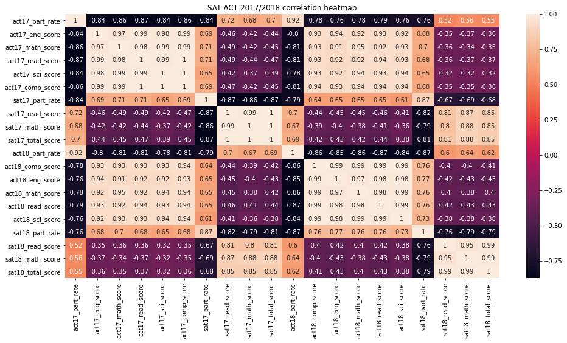
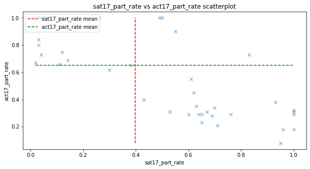

# Project-1 SAT & ACT Analysis
Project 1: Standardized Testing, Statistical Summaries and Inference

The SAT and ACT are standardised test for US university admissions. While the format of each test are different, most universities do not prefer one over the other. College Board is a mission-driven not-for-profit organization that runs the SAT test to connects students to college success and opportunity. It is important to increase participation rates of the SAT as it provides a better chance for a student to enter college.

As there are 2 standardised test, different high schools have different approaches as to which test to take, often this is decided by the state's education board. For this reason, we see some states that highly participates in the SAT and not the ACT and vice versa.

The ACT took over as the market leader of admissions test since 2012 (Source: https://www.washingtonpost.com/education/2018/10/23/sat-reclaims-title-most-widely-used-college-admission-test/). College Board is looking to increase the SAT participation.

In this notebook, we seek to use statistical analysis with Python to analyse how to increase the SAT's participation rates in the US. We will be using Pandas for data importing, cleaning and analysis. Matplotlib, Seaborn and Tableau for data visualisation.

# Problem Statement
Which states in the US should College Board target to increase the national participation rate of the SAT?

# Executive Summary

### Data Import & Cleaning

The 4 dataset used for this project include 2017 SAT, 2017 ACT, 2018 SAT and 2018 ACT participation rates and results. The approach taken was to clean the data for wrong information, data type errors. The data is then merged into 1 data set with all the information from the 4 datasets.

### Exploratory Data Analysis and Visualisation

With the combined dataset, we conducted Exploratory Data Analysis, to investigate trend in the data. Data visualisation tools from Matplotlib, Seaborn and Tableau were used to help in identifying relationship between the variables.

To summarise the relationships, look at the correlation matrix

SAT participation rate is negatively correlated with ACT participation rate. This is expected, as local education boards will typically choose 1 of the college admissions exams to prioritise over the other. So if the SAT participation rate is high in a state, the ACT participation will likely be lower.

SAT participation rate is postively correlated with ACT scores. This in combination with the negative relationship with ACT participation tells a story. States with high SAT participation on average will have lower ACT participation rates, the students sitting for ACT will likely be doing it to improve their college admission chances/ are likely more hardworking. The opposite is true, where a high ACT participation (due to mandatory graduation conditions) may imply that there are students who are forced to take the exams when they are unprepared. So SAT participation rates will be positively correlated with ACT scores.

SAT participation rate is negatively correlated with SAT scores. This follows the argument above, where there is a difference in the population of students when the participation rate is high. The population of students who take an examination when it is optional has a selection bias and are not representative of the entire student population of the state in general.

### Findings

There are 3 types of states:
- High participation in ACT and low participation in SAT

- High participation in ACT and high participation in SAT

- Low participation in ACT and high participation in SAT

These 3 states will require a different strategy to increase the SAT participation rate.

# Data Dictionary
|Feature|Type|Dataset|Description|
|---|---|---|---|
|sat_17_state|object|SAT|The name of the state| 
|sat_17_part_rate|float|SAT|The participation rate of the state (%)| 
|sat_17_read_score|integer|SAT|The average score of the 'Evidence-Based Reading and Writing' test in the SAT of the state (max score 800)| 
|sat_17_math_score|integer|SAT|The average score of the 'Math' test in the SAT of the state (max score 800)| 
|sat_17_total_score|integer|SAT|The average total score of the 2 SAT tests combined of the state (max score 1600)| 
|act_17_state|object|ACT|The name of the state| 
|act_17_part_rate|object|ACT|The participation rate of the state (%)| 
|act17_eng_score|float|ACT|The average score of the 'English' test in the ACT of the state (max score 36)|
|act17_math_score|float|ACT|The average score of the 'Math' test in the ACT of the state (max score 36)|
|act17_read_score|float|ACT|The average score of the 'Reading' test in the ACT of the state (max score 36)|
|act17_sci_score|float|ACT|The average score of the 'Science' test in the ACT of the state (max score 36)|
|act17_comp_score|float|ACT|The average score of the average of the four test scores in the ACT of the state (max score 36)|
|sat_18_state|object|SAT|The name of the state| 
|sat_18_part_rate|float|SAT|The participation rate of the state (%)| 
|sat_18_read_score|integer|SAT|The average score of the 'Evidence-Based Reading and Writing' test in the SAT of the state (max score 800)| 
|sat_18_math_score|integer|SAT|The average score of the 'Math' test in the SAT of the state (max score 800)| 
|sat_18_total_score|integer|SAT|The average total score of the 2 SAT tests combined of the state (max score 1600)| 
|act_18_state|object|ACT|The name of the state| 
|act_18_part_rate|object|ACT|The participation rate of the state (%)| 
|act18_eng_score|float|ACT|The average score of the 'English' test in the ACT of the state (max score 36)|
|act18_math_score|float|ACT|The average score of the 'Math' test in the ACT of the state (max score 36)|
|act18_read_score|float|ACT|The average score of the 'Reading' test in the ACT of the state (max score 36)|
|act18_sci_score|float|ACT|The average score of the 'Science' test in the ACT of the state (max score 36)|
|act18_comp_score|float|ACT|The average score of the average of the four test scores in the ACT of the state (max score 36)|

# Conclusion

We segmentise the states into 3 categories. We will be using 2018 participation rates so as to propose actions from 2019 onwards. The states will be segmented based on the ACT or SAT participation rates, we will be treating. Group 1 will have SAT participation > 80%, group 2 will have ACT participation > 80% and group 3 will have neither tests participation rate >80%. For each of the group, there is a different strategy to increase/ maintain participation rate in a sensible and economical way.

1) States with very high (>80%) to full SAT participation rates - there is little room for any increase in SAT participation in these states. Typically these states already mandate it for students to take the SAT test to graduate. CollegeBoard should maintain the current approach with these states, revamping the syllabus when needed and providing accessability to students in need so as to not lose its current standing to the ACT.

2) States with very high (>80%) to full ACT participation rates - These states typically have multi-year contracts signed with ACT. While it is possible to raise participation rates in these countries, one could argue that it is not economical as students who see the value in SAT to boost their college admission chances will opt to take the SATs, further expansion is unlikely. College Board should take note when the contracts are up for bidding to regain market share. We have seen this happen in Colorado, Illonois and Rhode Island to name a few.

3) States with neither a high SAT nor high ACT participation rate - these are state that typically do not have contracts with either College Board or the ACT. This is the prime segment to target to increase SAT participation rates. We can see this segment in the bottom left quadrant in the scatter plot below.

In conclusion, College Board should focus their efforts to the states listed above in group 3 where ACT and SAT participation rates are < 80%. These are states that are likely not to have a contractual obligations to administer either the ACT or SAT to all students, hence they are the states which will provide greater returns on expansion efforts.

We recognise College Boards efforts to improve student accessibility, by revising the syllabus, with SAT School Day and free online tutoring with Khan Academy. This combined with making deals with schools and state education boards will help SAT improve its participation rate.

To add on to this, research has been done on what are the best practices to increase SAT participation.

1) Fee waivers

2) Offer SAT during school hours

3) Increase awareness of college accessibility

4) Establish "college going culture"

# Reference

https://www.washingtonpost.com/education/2018/10/23/sat-reclaims-title-most-widely-used-college-admission-test/

https://www.nytimes.com/elections/2016/results/president

https://www.testive.com/state-sat-act/

https://www.denverpost.com/2017/03/06/colorado-juniors-sat-college-exam/

https://collegereadiness.collegeboard.org/sat/k12-educators/sat-school-day/about

https://www.chicagotribune.com/news/ct-illinois-chooses-sat-met-20160211-story.html

https://www.providencejournal.com/news/20181025/with-sat-required-ri-sees-jump-in-participation-decline-in-scores

https://www.wvgazettemail.com/news/education/wv-chooses-sat-as-new-high-school-standardized-test-for-juniors/article_b60d2618-4943-56f6-b180-4b4442172ef8.html

https://collegereadiness.collegeboard.org/sat?navId=pages-sat

https://www.hanoverresearch.com/media/Best-Practices-to-Increase-SAT-Participation-1.pdf
